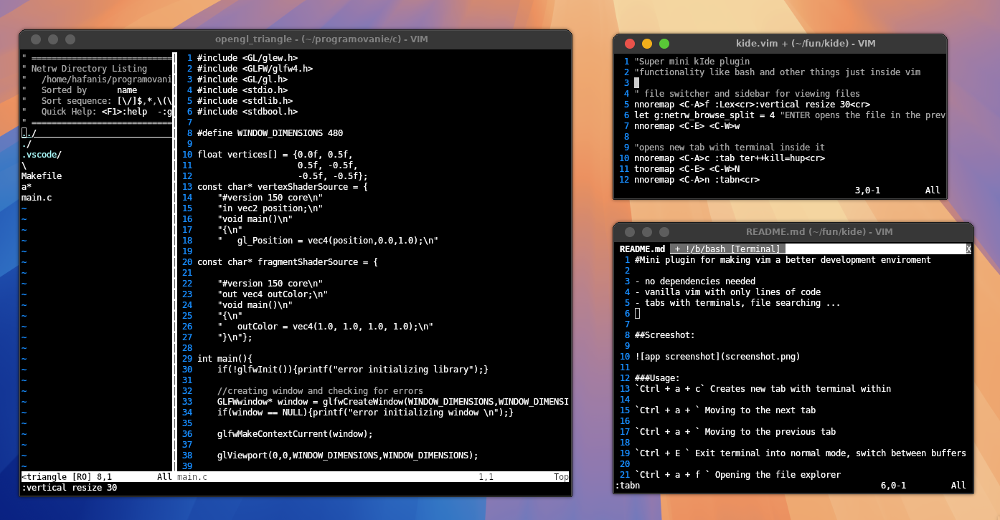

#Mini plugin for making vim a better development enviroment 

- no dependencies needed
- vanilla vim with only lines of code
- tabs with terminals, file searching ...

##Screeshot:

###Usage:
`Ctrl + a + c` Creates new tab with terminal within

`Ctrl + a + ` Moving to the next tab

`Ctrl + a + ` Moving to the previous tab

`Ctrl + E ` Exit terminal into normal mode, switch between buffers

`Ctrl + a + f ` Opening the file explorer
